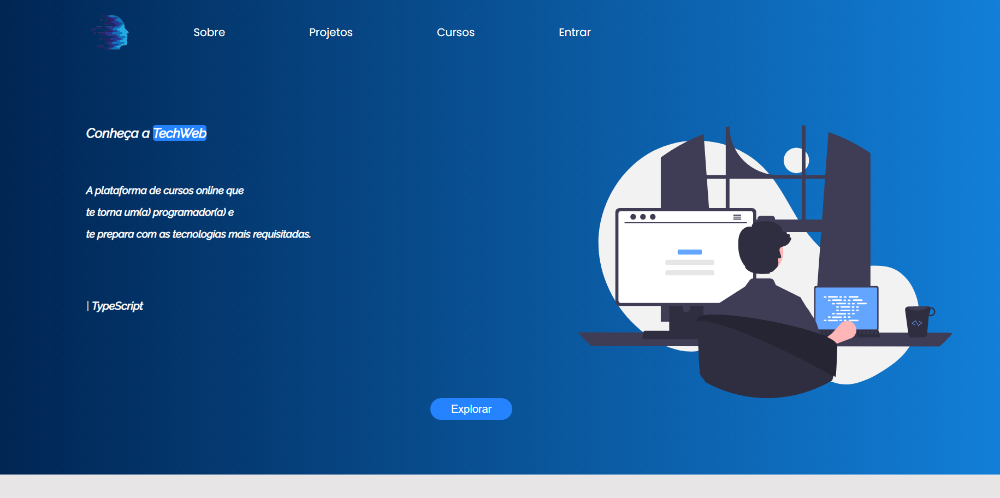

<h1>[PROJECT IN PROGRESS...]</h1>

 The objective of this project is to create the page of an online course platform for developers. 

 

<h2> This is a top of page </h2>

 

 

<h3> The following technologies are used in this project: </h3>  

CDN: <a> https://github.com/mattboldt/typed.js/ </a>
    
Library: <a> https://scrollrevealjs.org/ </a>

 

<ul>

    - HTML
    - CSS
    - JavaScript

<ul>