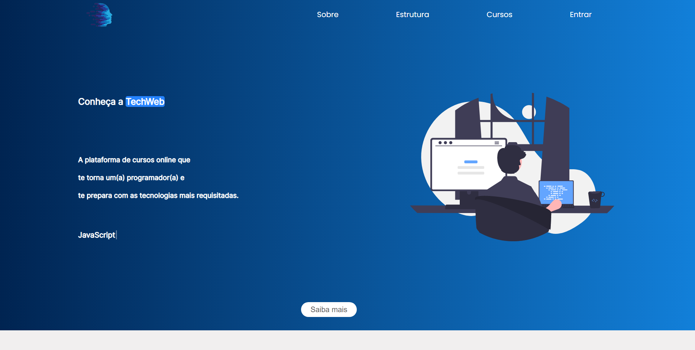
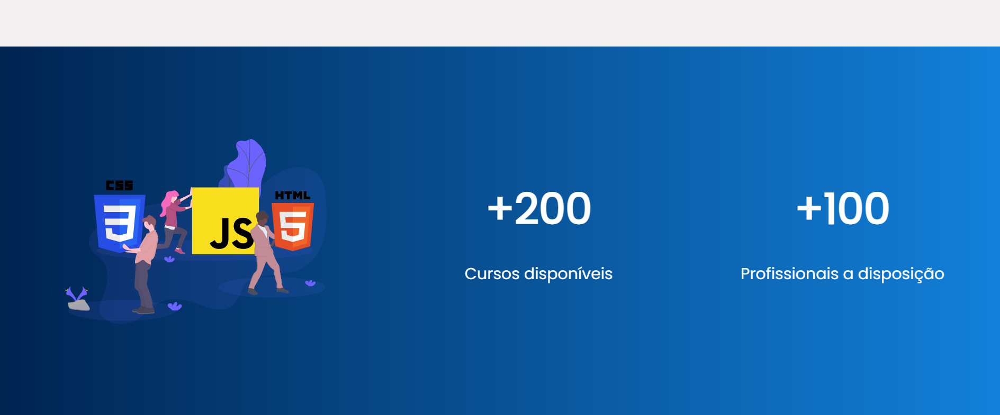
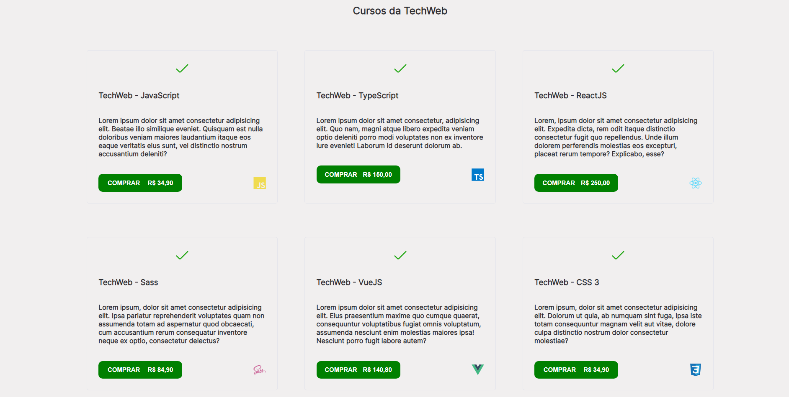

<h1>[PROJECT IN PROGRESS...]</h1>

 The objective of this project is to create the page of an online course platform for developers. 

 

<h2> This is a top of page </h2>

The first image that the customer sees when entering the platform is this. An intuitive and simple interface

 

  

<h2> Section (About) </h2>

By clicking on the "Learn more" button you are redirected to the "About" section,   here you can learn more about us and understand who we are and what we do

 

  

<h2> Section (Platform information) </h2>

In this section you can see information about the platform,   how many professionals are available and the number of courses

 

  

<h2> Section (Courses available on plataform) </h2>

In this section you can see the courses available to you and more information such as price and required experience level. You see several courses available by categories. From Frontend to Backend, Frameworks, Git, TypeScript and more.

 

  

- <h4>This is a responsive website</h4>

  

Project URL: <a> https://cheerful-squirrel-3098a2.netlify.app </a>

  

<h3> The following technologies are used in this project: </h3>  

CDN: <a> https://github.com/mattboldt/typed.js/ </a>

Library: <a> https://scrollrevealjs.org/ </a>

 

<ul>                                                                               

    - HTML
    - CSS
    - JavaScript

<ul>

 

Project contributor - (Diógenes Ribeiro de Oliveira) - [Visit my Linkedin](https://www.linkedin.com/in/diogenesriboliveira/)