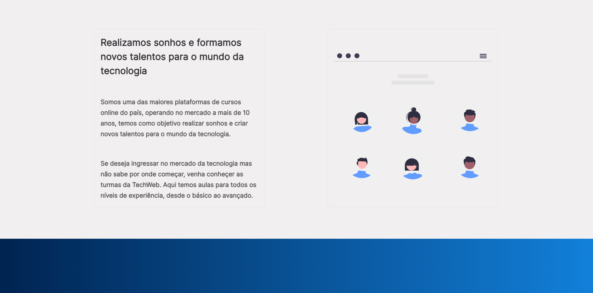

<h1>[PROJECT IN PROGRESS...]</h1>

 The objective of this project is to create the page of an online course platform for developers. 

 

<h2> This is a top of page </h2>

 

  

<h2> Section (About) </h2>

By clicking on the "Learn more" button you are redirected to the "About" section,   here you can learn more about us and understand who we are and what we do

 

  

<h2> Section (Platform information) </h2>

In this section you can see information about the platform,   how many professionals are available and the number of courses

 

   

- <h3>This is a responsive website</h3>

<h3> The following technologies are used in this project: </h3>  

CDN: <a> https://github.com/mattboldt/typed.js/ </a>
    
Library: <a> https://scrollrevealjs.org/ </a>

 

<ul>

    - HTML
    - CSS
    - JavaScript

<ul>